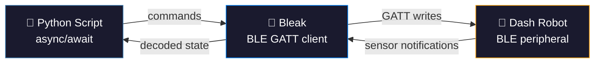

<p align="center">
  
</p>

<h1 align="center">Dash Robot</h1>

<p align="center">
  <strong>Vibe-coded Python controller for Wonder Workshop's Dash robot</strong><br>
  <sub>Connect over Bluetooth LE. Drive, spin, light up, play sounds, read sensors. All from Python.</sub>
</p>

<p align="center">
  <a href="https://github.com/brentrager/dash"></a>
  <a href="https://github.com/brentrager/dash/blob/main/LICENSE"></a>
  <a href="https://store.makewonder.com/products/dash"></a>
</p>

<table align="center"><tr><td align="center">
  <a href="https://smoo.ai"></a><br>
  <sub><em>A project by <a href="https://rager.tech">Brent Rager</a> — founder of <a href="https://smoo.ai">Smoo AI</a></em></sub><br>
  <sub>AI agents, dev tools, CRM, support &amp; campaigns that integrate with everything you build.<br><a href="https://smoo.ai/work-with-us">Let's talk.</a></sub>
</td></tr></table>

---

## What Is This?

[Dash](https://store.makewonder.com/products/dash) is a \$190 kids' coding robot by Wonder Workshop. It drives, spins, lights up, plays sounds, and has proximity/accelerometer/microphone sensors — all accessible over Bluetooth LE.

The official apps are drag-and-drop block coding. **This repo skips all that** and talks directly to Dash over BLE using Python and [bleak](https://github.com/hbldh/bleak). Write real async Python scripts to control your robot.

I got one for free and decided to vibe code it with [Claude Code](https://claude.ai/claude-code).

## Quick Start

```bash
# Clone and install
git clone https://github.com/brentrager/dash.git
cd dash
uv sync

# Turn on your Dash robot, then:
uv run python examples/lightshow.py
```

## Architecture



### BLE Protocol

| Layer | UUID | Direction | Purpose |
|:------|:-----|:----------|:--------|
| **Service** | `AF237777-879D-...` | — | Robot BLE service |
| **Command** | `AF230002-879D-...` | Write | Send commands (drive, lights, sound) |
| **Dash Sensors** | `AF230006-879D-...` | Notify | Proximity, wheels, head position |
| **Dot Sensors** | `AF230003-879D-...` | Notify | Accelerometer, buttons, mic, clap |

Commands are a single byte ID followed by a payload. The protocol was reverse-engineered by the community using BLE sniffers.

## API

```python
import asyncio
from dash_robot import discover_and_connect

async def main():
    robot = await discover_and_connect()

    # Lights
    await robot.neck_color("red")
    await robot.ear_color("#00ff00")
    await robot.eye_brightness(255)
    await robot.all_lights("purple")

    # Movement
    await robot.drive(200)          # Forward
    await robot.move(500)           # Move 500mm and stop
    await robot.turn(90)            # Turn 90 degrees
    await robot.spin(150)           # Spin in place
    await robot.stop()

    # Head
    await robot.look(yaw=30, pitch=5)

    # Sound (40+ built-in sounds)
    await robot.say("hi")
    await robot.say("laser")
    await robot.say("elephant")

    # Sensors (updated in real-time via BLE notify)
    print(robot.proximity)          # {'left': 0, 'right': 0, 'rear': 0}
    print(robot.is_picked_up)       # False
    print(robot.heard_clap)         # False
    print(robot.buttons)            # {'main': False, '1': False, ...}

    await robot.disconnect()

asyncio.run(main())
```

Context manager works too:

```python
async with await discover_and_connect() as robot:
    await robot.say("hi")
    await robot.move(300)
```

## Interactive CLI

```bash
uv run python cli.py
```

```
dash> connect
Scanning for Dash...
Connected to XX:XX:XX:XX:XX:XX

dash> neck red
dash> say hi
dash> drive 200
dash> stop
dash> move 500
dash> turn 90
dash> sensors
  Proximity: L=0 R=0 Rear=0
  Picked up: False
  Clap: False

dash> sounds
beep, boat, bragging, buzz, bye, cat, charge, ...

dash> quit
```

## Examples

| Script | What It Does |
|:-------|:-------------|
| [`lightshow.py`](examples/lightshow.py) | Rainbow color cycle on all LEDs |
| [`drive_square.py`](examples/drive_square.py) | Drive in a square pattern |
| [`react_to_clap.py`](examples/react_to_clap.py) | Random sound + color on clap detection |
| [`obstacle_avoid.py`](examples/obstacle_avoid.py) | Autonomous obstacle avoidance using proximity sensors |

```bash
uv run python examples/lightshow.py
uv run python examples/drive_square.py
uv run python examples/react_to_clap.py
uv run python examples/obstacle_avoid.py
```

## Available Sounds

<details>
<summary>40+ built-in sounds</summary>

| Category | Sounds |
|:---------|:-------|
| **Voices** | hi, bragging, ohno, ayayay, confused, huh, okay, yawn, tada, wee, bye, charge |
| **Animals** | elephant, horse, cat, dog, dino, lion, goat, croc |
| **Vehicles** | siren, horn, engine, tires, helicopter, jet, boat, train |
| **Effects** | beep, laser, gobble, buzz, squeek |

</details>

## Sensor Reference

<details>
<summary>All sensor fields</summary>

| Sensor | Field | Type | Source |
|:-------|:------|:-----|:-------|
| **Proximity** | `prox_left`, `prox_right`, `prox_rear` | int | Dash stream |
| **Wheels** | `left_wheel`, `right_wheel`, `wheel_distance` | int | Dash stream |
| **Head** | `head_yaw`, `head_pitch` | int | Dash stream |
| **Orientation** | `yaw`, `yaw_delta`, `pitch_delta`, `roll_delta` | int | Dash stream |
| **Accelerometer** | `pitch`, `roll`, `acceleration` | int | Dot stream |
| **Buttons** | `button_main`, `button_1`, `button_2`, `button_3` | bool | Dot stream |
| **State** | `moving`, `picked_up`, `hit`, `on_side` | bool | Dot stream |
| **Audio** | `clap`, `mic_level`, `sound_direction` | mixed | Dot stream |

Access via `robot.state["field_name"]` or convenience properties like `robot.proximity`.

</details>

## Tech Stack

<table>
  <tr>
    <td align="center" width="96"><br><sub>Python 3.13</sub></td>
    <td align="center" width="96"><br><sub>Bleak (BLE)</sub></td>
    <td align="center" width="96"><br><sub>Ruff</sub></td>
    <td align="center" width="96"><br><sub>uv</sub></td>
  </tr>
</table>

## Development

```bash
# Format + lint
uv run ruff format . && uv run ruff check .

# Type check
uv run ty check
```

## Credits

BLE protocol knowledge from the community:
- [bleak-dash](https://github.com/mewmix/bleak-dash) by mewmix
- [morseapi](https://github.com/IlyaSukhanov/morseapi) by Ilya Sukhanov
- [WonderPy](https://github.com/playi/WonderPy) (official, Python 2 only)

---

<p align="center">
  <sub>Built by <a href="https://rager.tech">Brent Rager</a> at <a href="https://smoo.ai">Smoo AI</a> with <a href="https://claude.ai/claude-code">Claude Code</a></sub>
</p>
